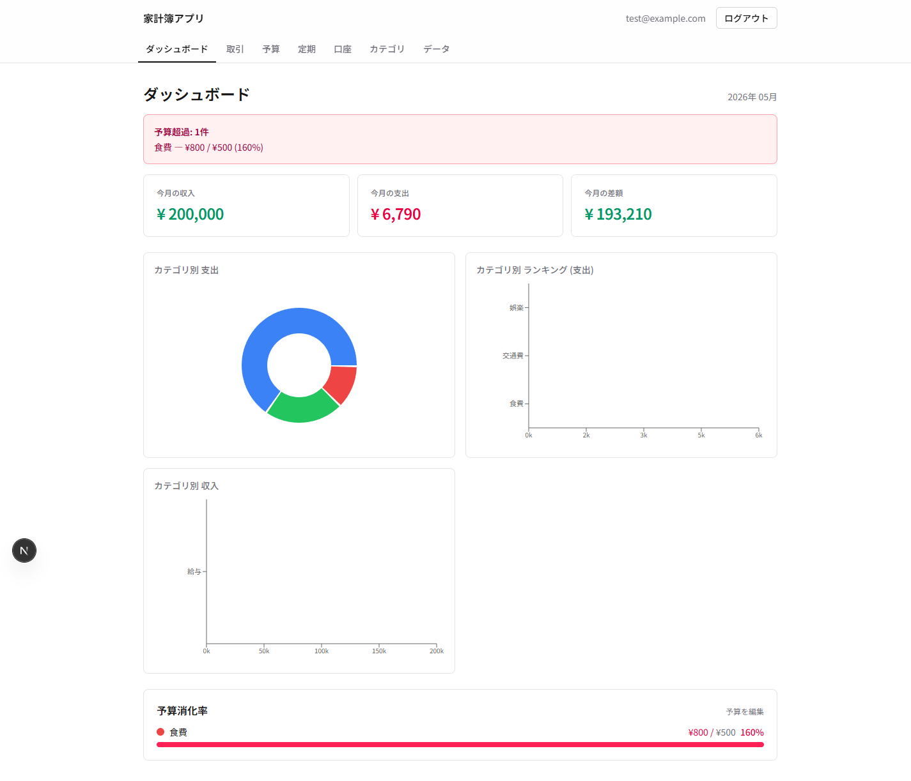
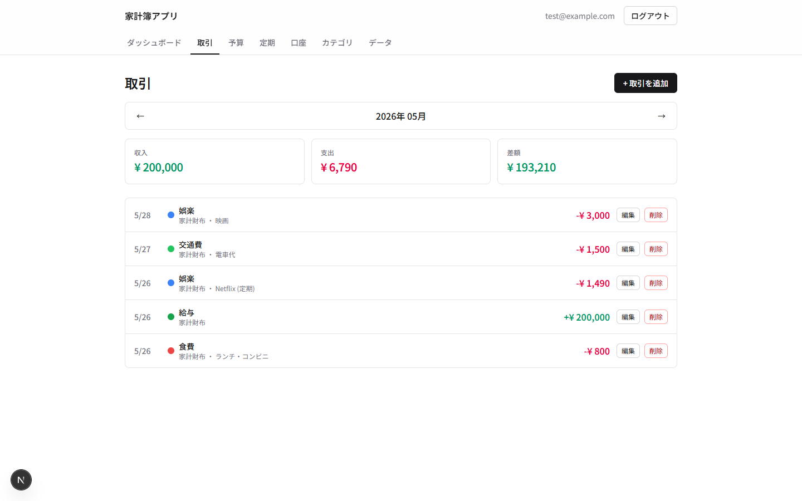
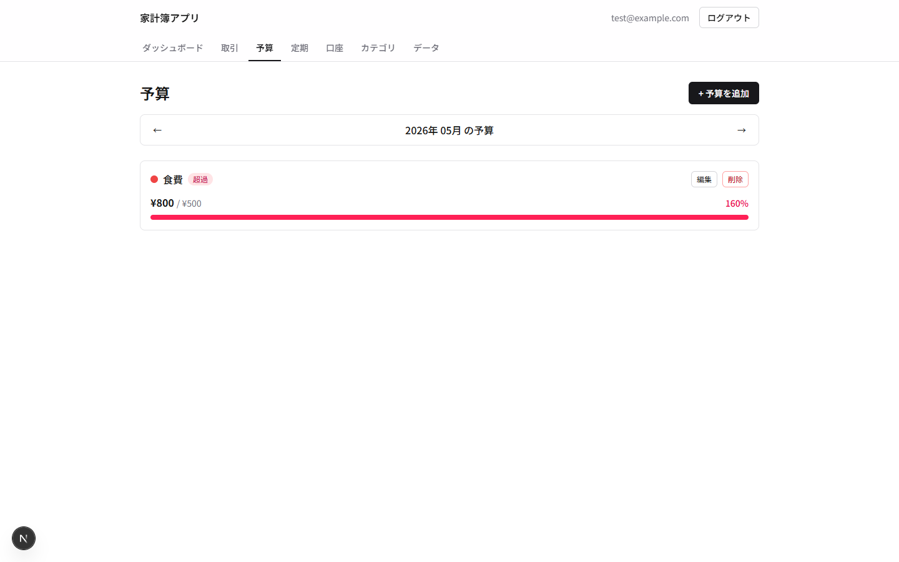
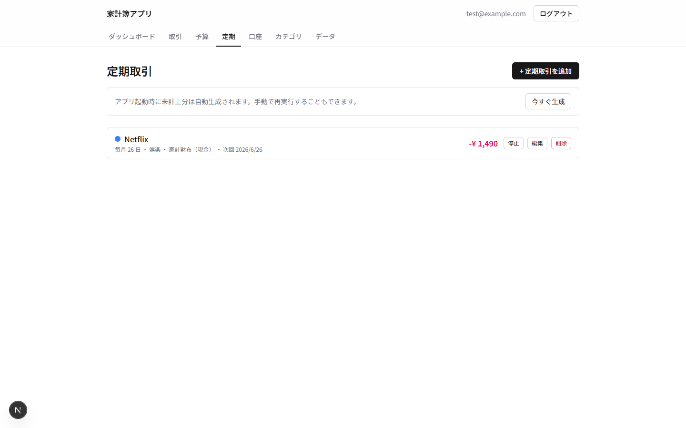
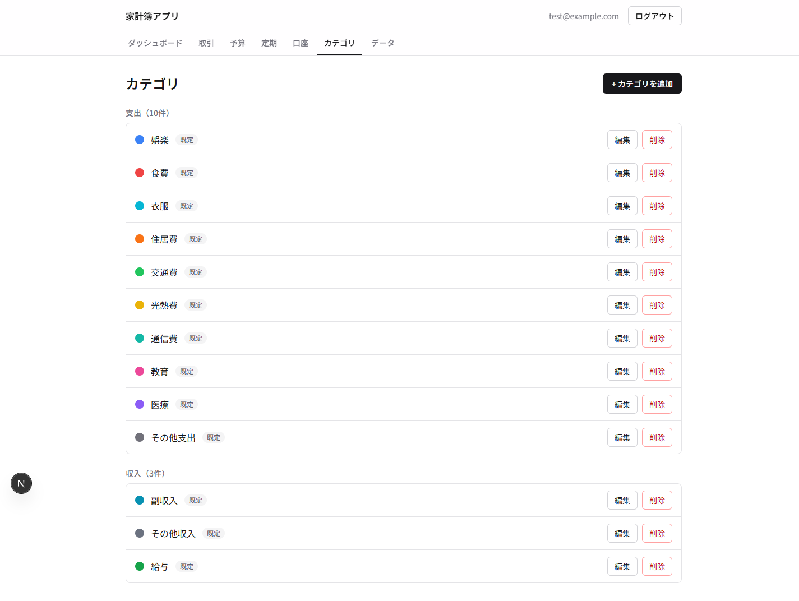
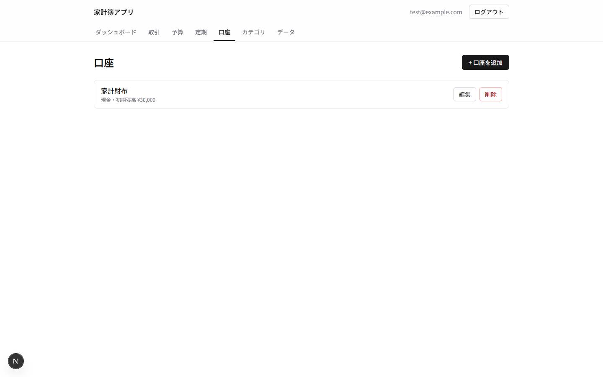
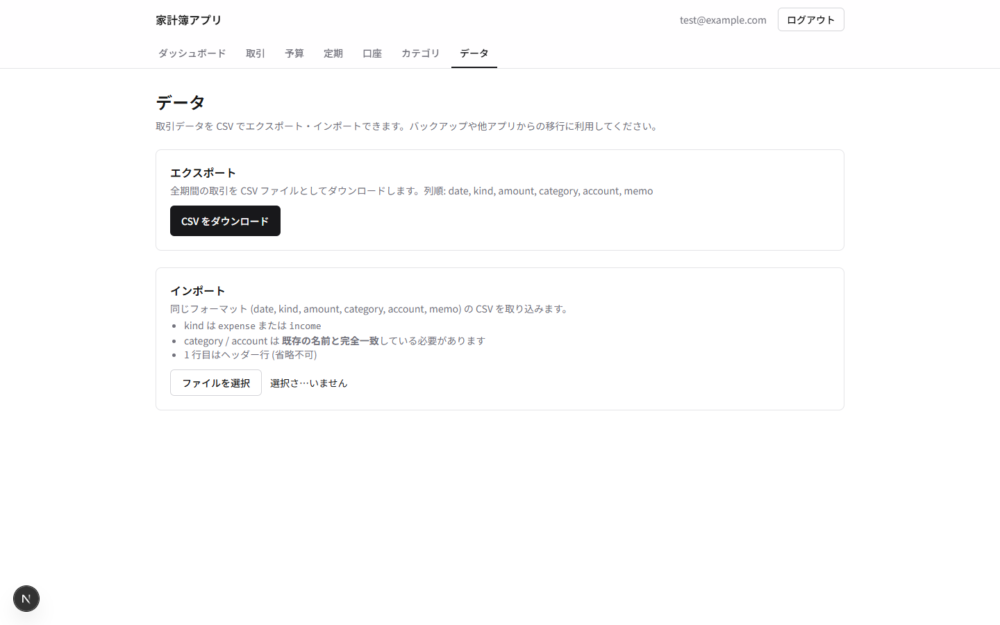
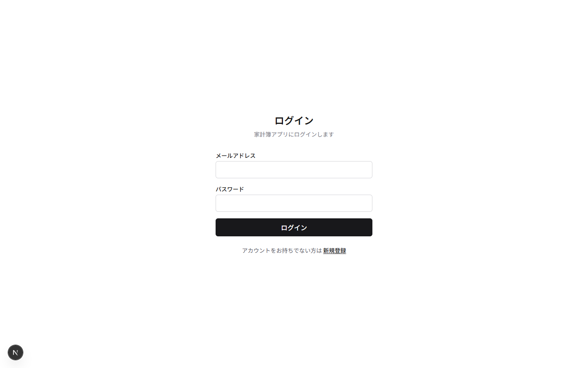
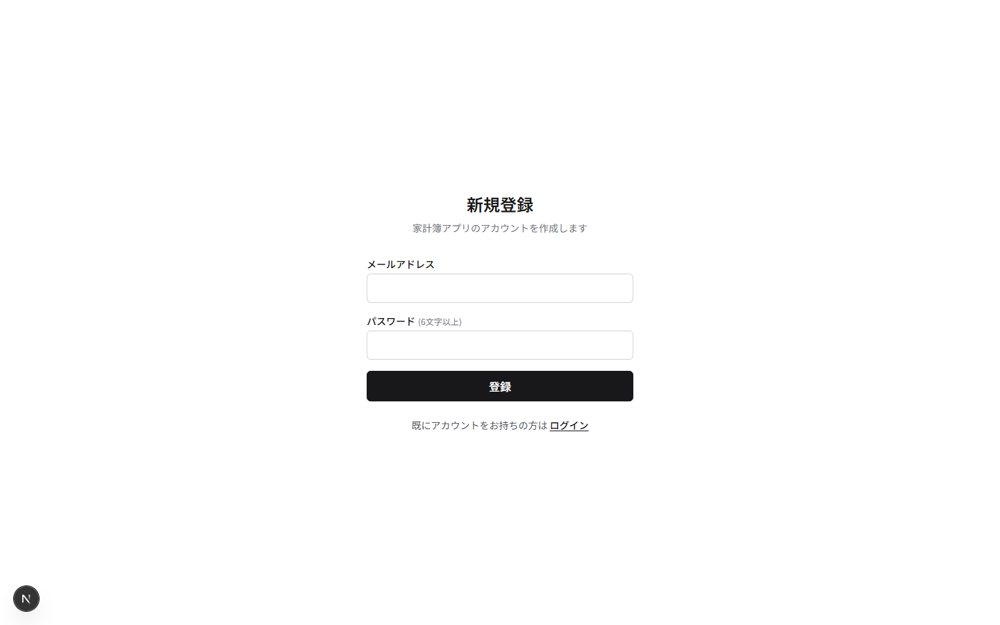

# 家計簿アプリ (Household Account Book)

個人向け Web 家計簿アプリ。収入・支出・予算・口座を Firestore に保存し、PC とスマホで同期できます。Next.js (App Router) と Firebase で構築しています。

## 🚀 Live Demo

**https://household-account-book-ggv4243x1-tsuguchis-projects.vercel.app**

Vercel にデプロイされた本番環境です。サインアップして実際に利用できます。

## 主な機能

| 要件 | 内容 |
|---|---|
| F1 認証 | メール+パスワードでのログイン／新規登録／ログアウト |
| F2 取引入力 | 収支区分・日付・金額・カテゴリ・口座・メモを記録、月切替・編集・削除 |
| F3 カテゴリ管理 | 収支区分付きカテゴリの CRUD、デフォルト 13 件のワンクリックシード |
| F4 集計・グラフ | 月次サマリ＋ Recharts によるカテゴリ別の円・棒グラフ |
| F5 予算 | カテゴリ別月次予算の CRUD、80% 警告 / 100% 超過バナー、進捗バー |
| F6 定期取引 | テンプレート登録、アプリ起動時に未計上分を自動生成（月末丸め対応） |
| F7 口座管理 | 現金 / 銀行 / カード / その他の 4 種別、初期残高設定 |
| F8 CSV 入出力 | 全期間の取引を CSV エクスポート、同フォーマットのインポート |

## スクリーンショット

### ダッシュボード
収入・支出・差額のサマリと、カテゴリ別のグラフ・予算消化率を表示。予算超過時はバナーで通知。



### 取引
月切替で当月の取引を一覧表示。フォームで収入・支出を入力。



### 予算
カテゴリ別の月次予算と消化率を管理。



### 定期取引
家賃・サブスク等を毎月自動で計上するテンプレートを管理。



### カテゴリ・口座・データ

| カテゴリ | 口座 | データ入出力 |
|---|---|---|
|  |  |  |

### 認証

| ログイン | 新規登録 |
|---|---|
|  |  |

## 技術スタック

- **フロントエンド**: Next.js 16.2 (App Router) / React 19 / TypeScript
- **スタイル**: Tailwind CSS v4 / Noto Sans JP
- **グラフ**: Recharts
- **バックエンド**: Firebase Authentication / Cloud Firestore
- **ホスティング**: Vercel
- **言語**: 日本語のみ / 通貨は日本円のみ

## データモデル

```
users/{userId}
  ├── accounts/{accountId}     name / type / initialBalance
  ├── categories/{categoryId}  name / color / kind / isDefault
  ├── budgets/{budgetId}       yearMonth / categoryId / amount
  ├── transactions/{txId}      date / amount / kind / categoryId / accountId / memo
  └── recurring/{recurringId}  name / amount / kind / categoryId / accountId / dayOfMonth / nextRunDate / active
```

Firestore Security Rules は `users/{userId}/**` を本人のみ読み書き可に制限しています ([firestore.rules](firestore.rules))。

## セットアップ

### 必要環境

- Node.js 20 以上 (推奨 24)
- Firebase プロジェクト (Authentication と Firestore が有効化済み)

### 1. リポジトリ取得 & 依存インストール

```bash
git clone https://github.com/tsuguchi/household-account-book.git
cd household-account-book
npm install
```

### 2. Firebase の準備

1. [Firebase Console](https://console.firebase.google.com/) で新規プロジェクトを作成
2. **Authentication** → Sign-in method → **メール/パスワード** を有効化
3. **Firestore Database** を作成（推奨リージョン: `asia-northeast1`、本番モード）
4. **Project settings** → **General** → **Your apps** で Web アプリを登録し、SDK 設定値を取得
5. **Firestore** → **Rules** タブに [firestore.rules](firestore.rules) の内容を貼り付けて公開

### 3. 環境変数を設定

`.env.local.example` をコピーして `.env.local` を作り、Firebase の値を入れてください。

```bash
cp .env.local.example .env.local
# 値を編集
```

```
NEXT_PUBLIC_FIREBASE_API_KEY=
NEXT_PUBLIC_FIREBASE_AUTH_DOMAIN=
NEXT_PUBLIC_FIREBASE_PROJECT_ID=
NEXT_PUBLIC_FIREBASE_STORAGE_BUCKET=
NEXT_PUBLIC_FIREBASE_MESSAGING_SENDER_ID=
NEXT_PUBLIC_FIREBASE_APP_ID=
```

### 4. 開発サーバー起動

```bash
npm run dev
```

[http://localhost:3000](http://localhost:3000) を開いてサインアップしてください。

### 5. プロダクションビルド

```bash
npm run build
npm run start
```

## Vercel へのデプロイ

1. [Vercel](https://vercel.com/new) で GitHub リポジトリを Import
2. **Environment Variables** に上記 6 つの `NEXT_PUBLIC_FIREBASE_*` を Production / Preview / Development すべてで設定
3. Deploy
4. デプロイ後、Firebase Console → Authentication → **Settings** → **Authorized domains** に Vercel のドメイン (`xxx.vercel.app`) を追加

> `NEXT_PUBLIC_*` 変数はビルド時に埋め込まれるため、env を変更したら必ず再デプロイ（"Use existing Build Cache" のチェックを外す）してください。

## ディレクトリ構成

```
src/
  app/
    (auth)/           ログイン・新規登録 (未認証向け)
    (app)/            ダッシュボード等の保護ルート群
    layout.tsx        AuthProvider と全体テーマ
    page.tsx          / から /login or /dashboard へのリダイレクト
  contexts/
    AuthContext.tsx   onAuthStateChanged を全アプリで購読
  lib/
    firebase.ts       getFirebaseAuth() / getFirebaseDb() (遅延初期化)
    auth.ts           signIn / signUp / signOut + 日本語エラー変換
    accounts.ts       口座の subscribe / CRUD
    categories.ts     カテゴリの subscribe / CRUD + デフォルトシード
    transactions.ts   取引の月次クエリ + CRUD
    budgets.ts        予算の月指定クエリ + CRUD
    recurring.ts      定期取引 CRUD + processRecurringDue
    aggregations.ts   summarize / breakdownByCategory / budgetConsumption
    csv.ts            CSV シリアライズ・パース・ダウンロード
    dataIo.ts         取引のエクスポート / インポート
  types/              Account / Category / Transaction / Budget / Recurring
```

## スコープ外（フェーズ 2 以降）

- レシート OCR
- 銀行・カード API 連携
- 家族間共有・複数ユーザー
- プッシュ通知 / メール通知
- 多通貨対応
- ネイティブアプリ化（PWA は将来検討）

## ライセンス

個人プロジェクトのため、ライセンスは未設定です。
